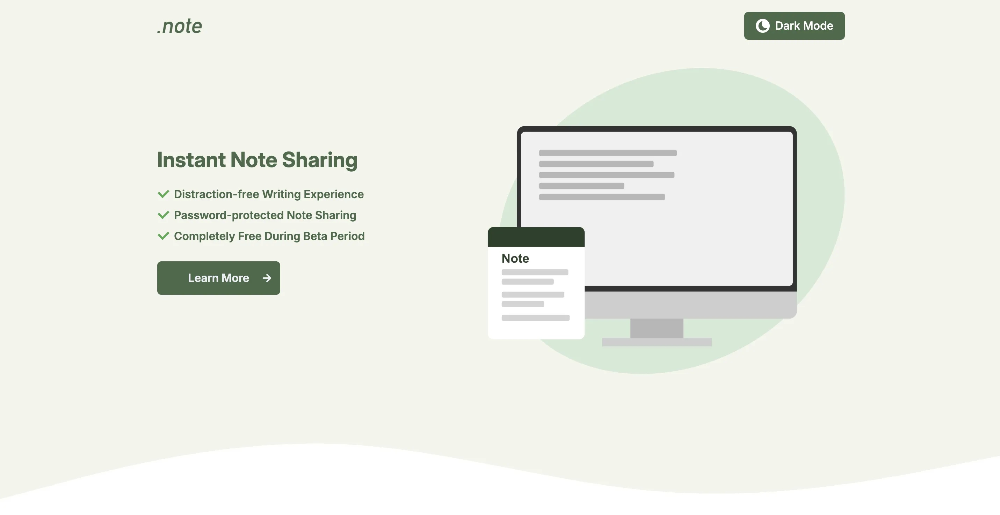
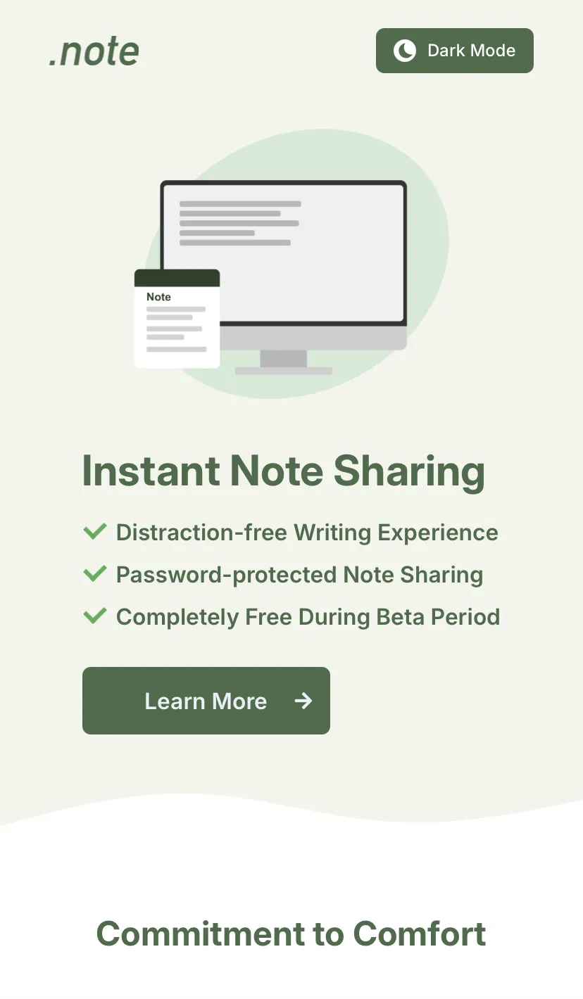

# .note - Personal Portfolio

<div align="center">
  
  
  <br><br>
  <a href="https://dot-note-76ea6.web.app/" target="_blank">
    
  </a>
  <br><br>
  <p>
    <a href="#overview">Overview</a> •
    <a href="#what-i-learned">What I Learned</a> •
    <a href="#tech-stack">Tech Stack</a> •
    <a href="#installation">Installation</a> •
    <a href="#license">License</a>
  </p>
</div>

## Overview

This project is a fictional landing page for a note-sharing web app.    
It was created as part of my front-end development portfolio to demonstrate React development skills, and familiarity with modern tooling.

## What I Learned
### Technical Skills
- Learned how to use React Router by implementing multi-page navigation
- Used Tailwind CSS and implemented dark mode for the first time  
 (initially tested in a separate experiment project [here](https://github.com/hidaka88jp/learning--tailwind-dark-mode))
- Learned how to configure ESLint, Prettier, and Husky from scratch to ensure code quality and automate pre-commit checks
- Wrote my first test cases using Vitest and Testing Library
- Learned Firebase Hosting for deployment
- Studied the basics of GitHub Actions to customize the workflow generated by the Firebase CLI, enabling automated testing on pull requests and deployment

### Development Process
- Recreated and customized a design originally made for HTML/CSS practice, implementing it in React and adapting the layout and structure
- Experienced the full development flow of a React app beyond tutorials
- Learned Markdown syntax to write proper project documentation (like this README)

## Tech Stack

<table>
  <tr>
    <th>Frontend</th>
    <td>
      
      
      
      
    </td>
  </tr>
  <tr>
    <th>Code Quality</th>
    <td>
      
      
      
    </td>
  </tr>
  <tr>
    <th>Testing</th>
    <td>
      
      
    </td>
  </tr>
  <tr>
    <th>Deployment</th>
    <td>
      
      
    </td>
  </tr>
  <tr>
    <th>Tools</th>
    <td>
      
    </td>
  </tr>
</table>

## Installation

If you want to run this project locally, clone the repository and install the dependencies:

```bash
git clone https://github.com/hidaka88jp/portfolio--dot-note.git
cd portfolio--dot-note
npm install
npm run dev
```

## License

This project was created for educational and portfolio use.  
Licensed under the [MIT License](./LICENSE).  

Please note that the UI design was inspired by [Mosha Shugyo](https://moshashugyo.com/) HTML/CSS exercises and is **not** MIT-licensed.  
Refer to their site for details on usage permissions.